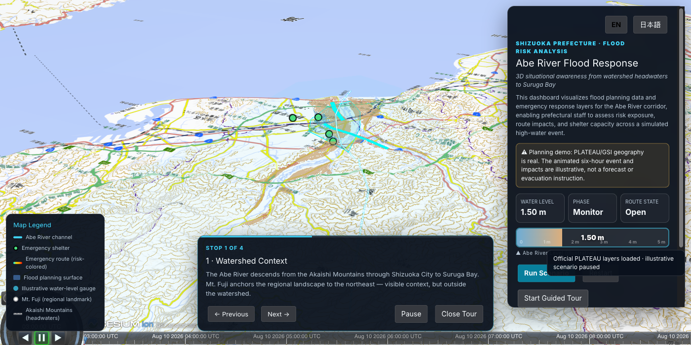
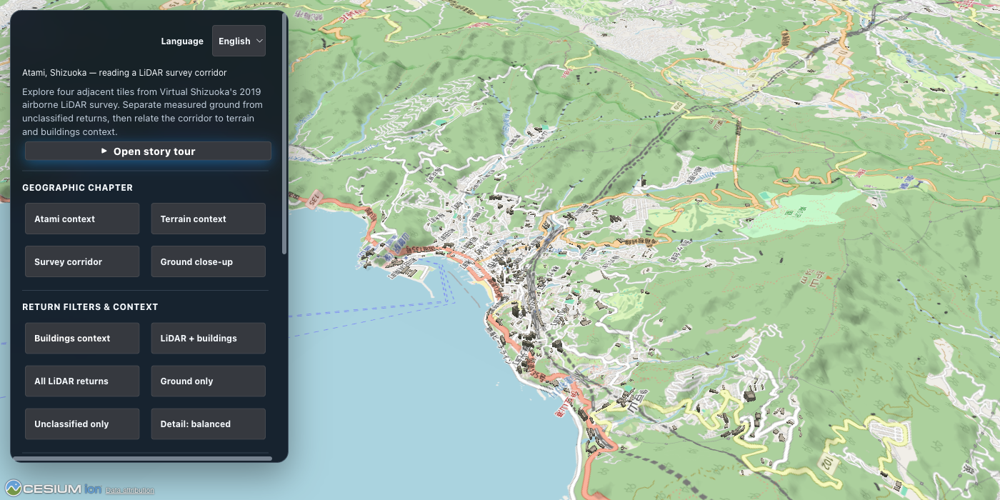
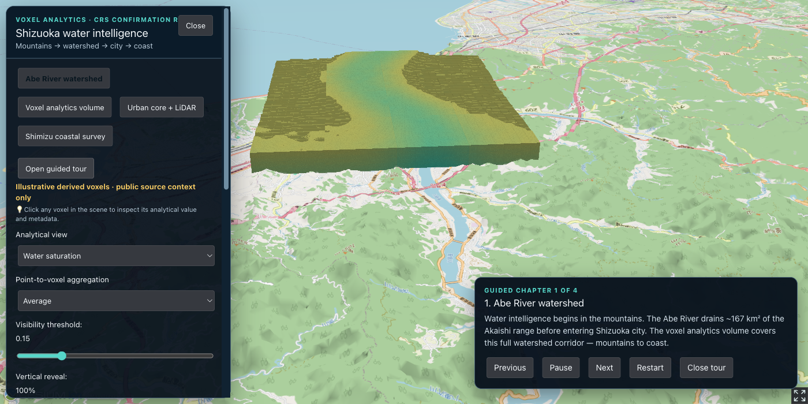
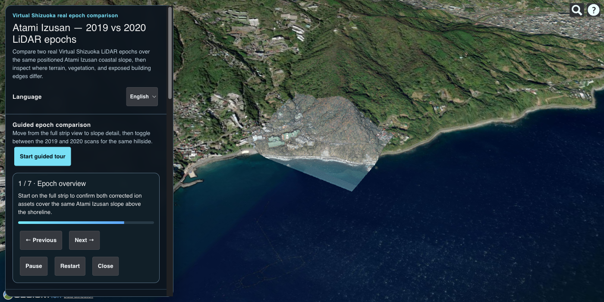

# Shizuoka Prefecture CesiumJS Demo Suite

Four interactive CesiumJS demonstrations show how Shizuoka's terrain,
buildings, LiDAR, flood-planning surfaces, volumetric analytics, and coastal
bathymetry can be combined into a single 3D decision environment.

## Explore the suite

- **[Open the live GitHub Pages implementation](https://jastman.github.io/shizuoka-demo-cesium-BD/)**
- **[Read the presenter guide](docs/shizuoka-demo-presenter-guide.md)** for the
  full BD/PSS presentation narrative, run instructions, technical details,
  data sources, caveats, and spoken scripts.

## Demos

### Abe River Flood Response

An interactive flood-response dashboard for the Abe River corridor. It combines
PLATEAU buildings, flood-planning surfaces, emergency routes, shelters, terrain,
and a guided high-water scenario so stakeholders can discuss risk exposure and
response context in one view. The scenario controls and animated impacts are
illustrative; the underlying planning geography is real.

### Atami LiDAR Survey Corridor

An Atami hillside LiDAR exploration using four adjacent Virtual Shizuoka 2019
point-cloud tiles. Users can switch between all returns, ground, and
unclassified returns, compare the survey with terrain and buildings, and use
RRIM imagery to read ridges, drainage, and slope form.

### Shizuoka Water Intelligence

A volumetric analytics experience that organizes a watershed-scale model into
interactive voxels. It demonstrates threshold filtering, aggregation modes,
vertical reveal, voxel picking, metadata inspection, and a transition to
measured Shimizu coastal bathymetry. The watershed voxel values are procedural
illustrations of an analysis workflow, not a calibrated operational product.

### Atami LiDAR Epoch Comparison

A visual comparison of real Virtual Shizuoka 2019 and 2020 LiDAR epochs over
the same Atami Izusan coastal slope. Two separately streamed point-cloud
tilesets can be shown independently or together with buildings and imagery,
supporting discussion of terrain, vegetation, and exposed structure changes.
This is a visual epoch comparison rather than a computed per-point change
surface.

## Technology and data

The experiences use CesiumJS and Cesium Ion to stream terrain, imagery, 3D
Tiles, and point clouds. Data references include Virtual Shizuoka LiDAR,
MLIT/PLATEAU planning and building data, Japan GSI map products, Cesium World
Terrain and Imagery, OpenStreetMap-derived buildings, and Virtual Shizuoka
coastal bathymetry.
